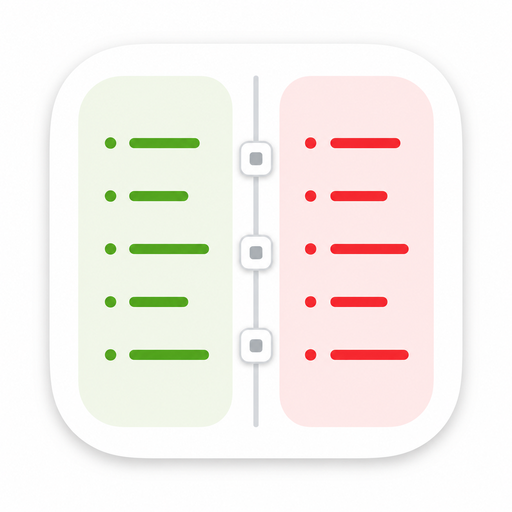

<p align="center">
  
</p>

# Diffy

Diffy is a small native macOS menu bar app for solo developers. It watches local git repositories and shows live working-tree diff stats directly in the menu bar.

Diffy is local-only and read-only. It does not use GitHub, GitLab, Bitbucket, PRs, issues, cloud services, or accounts. Its git commands are observational only.

## Status

v0.1.1— available via Homebrew Cask. The app uses macOS 26 Liquid Glass APIs and is ad-hoc signed (not notarized). Install instructions below handle Gatekeeper automatically.

## Features

- One menu bar badge per configured repository
- Repo-level `+x / -y` line counts in green and red
- Per-repo colors for additions, removals, and optional badge background
- Popover with staged and unstaged changed-file sections
- Per-file status labels like `M`, `A`, `D`, `U`, and `C`
- Per-file `+a / -b` counts
- Open changed files in a configured editor
- Filesystem-triggered refresh with polling fallback
- Sparkle-ready update packaging for GitHub Releases

## Build and Run Locally

From the Mac terminal:

```bash
swift test
./script/build_and_run.sh
```

The run script builds the SwiftPM target, creates `dist/Diffy.app`, ad-hoc signs it, and launches it.

## Package a Release

```bash
./script/package_release.sh 0.1.0 1
```

The zip is created at `dist/release/Diffy-0.1.0.zip`.

## Install

The easiest path is Homebrew. The `--no-quarantine` flag prevents the Gatekeeper dialog since Diffy is ad-hoc signed, not notarized:

```bash
brew tap nick701/diffy
brew install --cask --no-quarantine diffy
```

**Already installed without `--no-quarantine` and seeing a Gatekeeper dialog?** Run this once to clear it:

```bash
xattr -dr com.apple.quarantine /Applications/Diffy.app
```

Then reopen Diffy normally.

## Auto-Updates

Diffy includes Sparkle integration, but update checks are enabled only in release bundles that include a Sparkle appcast URL and EdDSA public key. See `docs/release.md`.

## Read-Only Guarantee

Diffy never stages, commits, checks out, cleans, resets, rebases, merges, or writes to watched repositories. It uses read-only git inspection commands with optional locks disabled.
