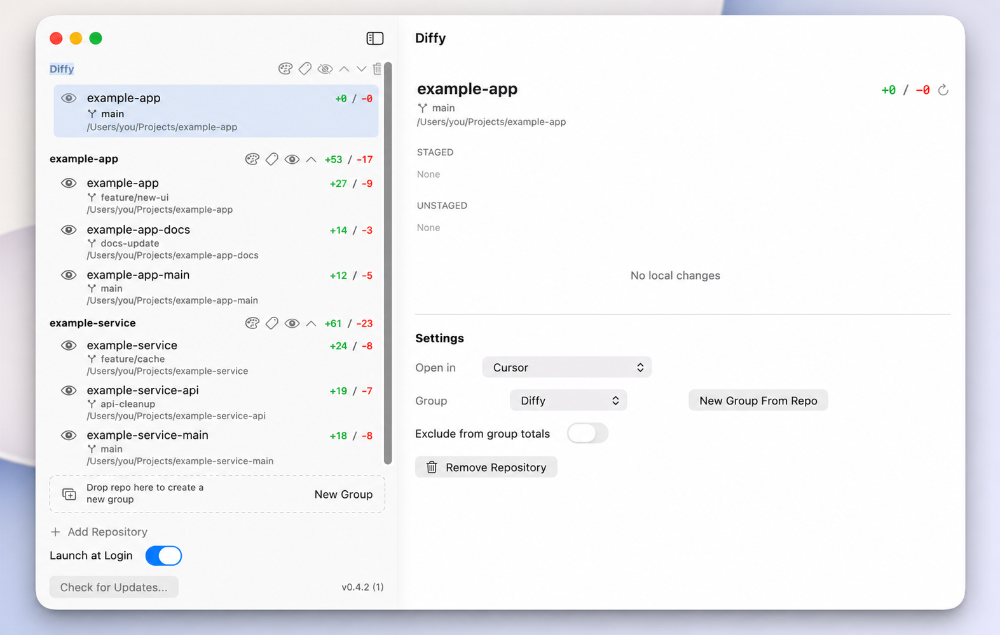
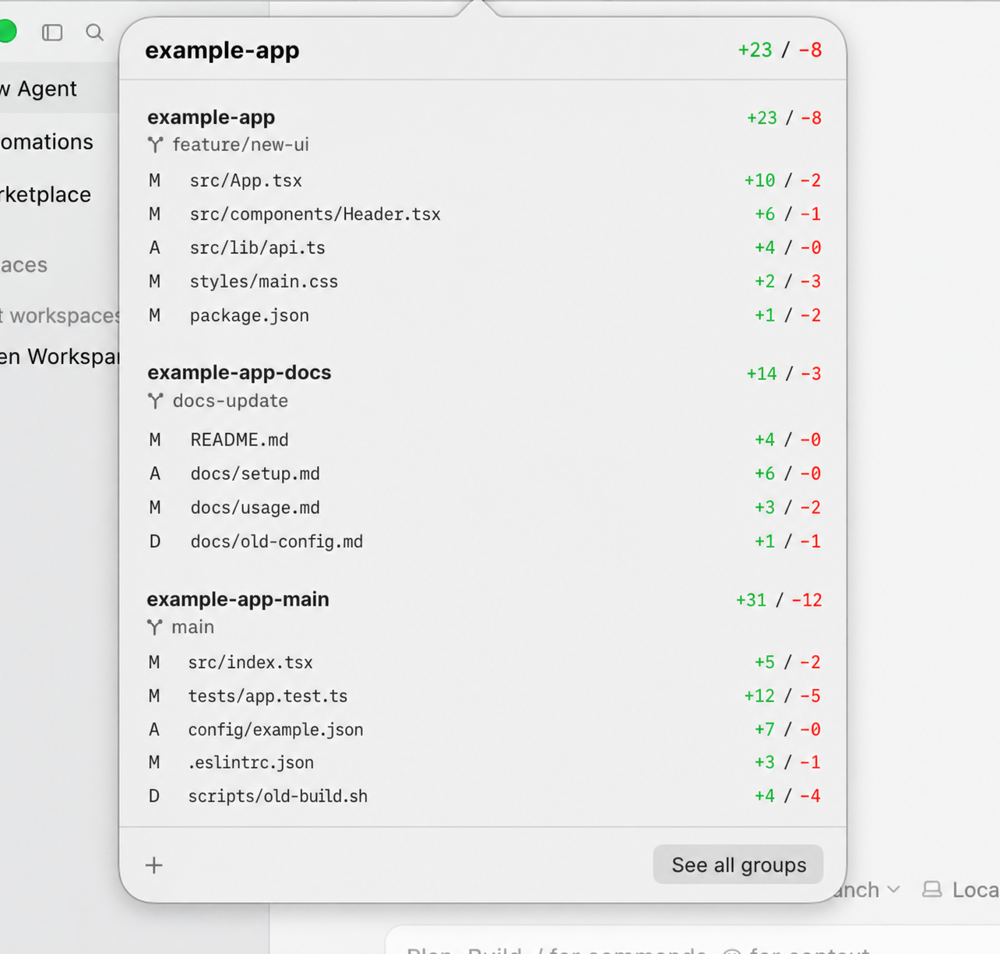

<p align="center">
  
</p>

# Diffy

Diffy is a small native macOS menu bar app for solo developers. It watches local git repositories and shows live working-tree diff stats directly in the menu bar.

Diffy is local-only. It does not use GitHub, GitLab, Bitbucket, PRs, issues, cloud services, or accounts. Its git commands are read-only with one explicit, user-initiated exception: removing a linked worktree from the in-app confirmation dialog.

## Status

v0.5.0 — available via Homebrew Cask. The app uses macOS 26 Liquid Glass APIs and is ad-hoc signed (not Developer ID signed or notarized). Install instructions below include the required manual Gatekeeper quarantine-clearing step.

This release adds on-demand recent commit history to every repository in the menu-bar popover, with per-commit changed-file statistics and local upstream status.

Diffy is feature-complete for its original scope; future updates are expected to focus on maintenance and bug fixes rather than major new features.

## Features

- **Groups**: every repo belongs to a group, and each group owns one menu-bar icon, one color scheme, and an optional small label (1–2 chars or an emoji, positioned around the `+/-` counts). New repos default to their own single-repo group; combine or split groups by drag-drop in the main window. A group with N repos shows the aggregate `+x / -y` of its (non-hidden) members.
- **Hide a group from the menu bar** with an eye toggle in the sidebar header — the icon disappears entirely until toggled back on. Per-repo "Exclude from group totals" is also available for silencing a noisy repo within a multi-repo group without removing the icon.
- Left-click any group's menu-bar icon opens a popover listing **that group's** repos with their staged and unstaged files — click a file to jump straight into your editor, or right-click it to copy its full path. "See all groups" opens the full main window.
- Expand **Recent commits** under any repository to see its last 1–20 commits (configured per repository), including short SHA, subject, time, and whether each commit is on the configured upstream, local only, or has no upstream. Expanding a commit shows file statuses and `+/-` totals without source-code hunks. Historical rows never open automatically; their context menu can copy the path or explicitly open the current working-tree version when it exists.
- Main window: sidebar with one section per group (drag-drop repos between sections, reorder groups, edit colors / labels / names / hidden state), detail pane with per-repo settings.
- Window close hides Diffy back to the menu bar (no quit); ⌘Q or right-click → Quit to actually exit.
- Per-repo detail pane: staged and unstaged changed-file sections with status labels (`M`, `A`, `D`, `U`, `C`, `!`) and per-file `+a / -b`.
- **Branch labels** on every row (popover, sidebar, detail pane). Detached HEAD shows the short SHA in italics.
- **Linked worktrees** discovered automatically from `git worktree list --porcelain` and shown as indented sub-rows under one family owner, each with their own diff stats and branch. Manually-added worktrees stay as top-level rows and are never duplicated under a sibling; the first manual row in a family owns only unadded siblings. Per-worktree "Exclude from group totals" works like any other repo. Remove a finished auto-managed worktree from inside Diffy via a confirmation dialog — Diffy never uses `--force`, so dirty worktrees must be handled in your terminal first.
- Open changed files in a configured editor (Xcode, Cursor, VS Code, Zed, or a custom shell command). Deleted-file rows are shown for context but are not opened from the working tree.
- **Launch at Login** toggle (requires Diffy installed to `/Applications`).
- Filesystem-triggered refresh with polling fallback.
- Homebrew updates today, with Sparkle packaged behind release metadata for a future appcast.

## Screenshots

At a glance, Diffy lives in the menu bar and shows the current group's aggregate working-tree diff.


Diffy's main window shows every tracked repository and worktree grouped by project, with aggregate additions and deletions visible before you open anything.



The menu-bar popover breaks a group down by worktree, branch, changed file, status, and per-file diff counts.



## Build and Run Locally

From the Mac terminal:

```bash
swift test
./script/build_and_run.sh
```

The run script builds the SwiftPM target, creates `dist/Diffy.app`, ad-hoc signs it, and launches it.

## Package a Release

```bash
./script/package_release.sh <version> <build>
```

The zip is created at `dist/release/Diffy-<version>.zip`.

## Install

The easiest path is Homebrew:

```bash
brew tap nick701/diffy
brew install --cask diffy
xattr -dr com.apple.quarantine /Applications/Diffy.app
```

The `xattr` step is required because Diffy is ad-hoc signed and not notarized — macOS will block it on first launch without it.

To upgrade an existing install:

```bash
brew upgrade --cask diffy
xattr -dr com.apple.quarantine /Applications/Diffy.app
```

## Auto-Updates

Diffy includes Sparkle integration, but update checks are enabled only in release bundles that include a Sparkle appcast URL and EdDSA public key. See `docs/release.md`.

## Read-Only Guarantee

Diffy is read-only with one explicit, user-initiated exception: removing a linked worktree via the in-app confirmation dialog (which runs `git worktree remove <path>` without `--force`). All other git operations Diffy performs (`diff`, `status`, `log`, `show`, `rev-list`, observational `rev-parse`, and `worktree list`) are strictly observational, run with `GIT_OPTIONAL_LOCKS=0` and `--no-optional-locks`. Commit publication labels compare against local remote-tracking refs; Diffy never fetches. Diffy never stages, commits, checks out, cleans, resets, rebases, merges, or otherwise mutates a repository's working tree.
